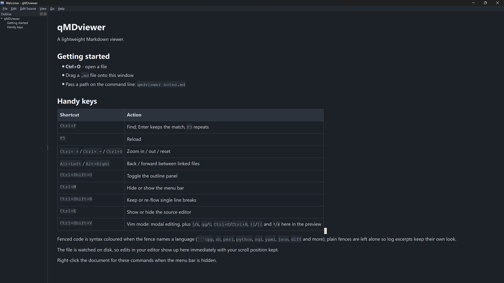

# qMDviewer

A lightweight cross-platform Markdown viewer written in Qt (C++17).

Rendering goes through `QTextDocument`'s built-in Markdown importer, so the
whole program is one small binary that links against nothing but Qt Widgets —
no web engine, no Markdown library, no bundled JavaScript. It builds against
either Qt 5.14+ or Qt 6.



More: [syntax colouring](docs/screenshot-light.png) ·
[editor with vim mode](docs/screenshot-editor.png)

## Install

Ready-made packages are on the
[1.0.0 release](https://github.com/andy12241025/qMDviewer/releases/tag/1.0.0):

- **Windows 10/11 (64-bit)**:
  [`qMDviewer-1.0.0-windows-x64.zip`](https://github.com/andy12241025/qMDviewer/releases/download/1.0.0/qMDviewer-1.0.0-windows-x64.zip)
  - unzip anywhere and run `qmdviewer.exe`; the Qt libraries are included.
- **Debian/Ubuntu (64-bit)**:
  [`qmdviewer_1.0.0_amd64.deb`](https://github.com/andy12241025/qMDviewer/releases/download/1.0.0/qmdviewer_1.0.0_amd64.deb)
  - `sudo apt install ./qmdviewer_1.0.0_amd64.deb`

Or build it yourself, which takes a few seconds; see [Building](#building).

## Features

- **Live reload.** The open file is watched on disk and re-rendered when it
  changes, keeping your scroll position. Handles editors that save by replacing
  the file (vim, VS Code) and re-arms the watch afterwards. Can be switched off.
- **Outline panel.** Headings are listed as a nested tree, click to jump, and
  the selection follows the scroll position.
- **Real Markdown styling.** Sized headings, monospaced code with a tinted
  background, bordered tables with a header row, dimmed blockquotes, task-list
  checkboxes, and comfortable line spacing.
- **Syntax colouring** for fenced code in C/C++/Java/JS/TS/Go/Rust, shell,
  Perl, Python, SQL, JSON, YAML, INI/TOML, diff and XML/HTML, using GitHub's
  palette in both themes. Fences without a language stay uncoloured, which
  keeps log excerpts and ASCII diagrams readable.
- **Link navigation.** Links to other local `.md` files open in place with
  back/forward history; `#heading` anchors jump within the document; anything
  else opens in your browser.
- **Images** are resolved relative to the document and scaled to fit the window
  (and re-scaled when it is resized).
- **Faithful line breaks.** Markdown normally folds a single newline into a
  space, which runs "**Q: ...?**" and its answer on the next line together. By
  default every newline in the source is kept as a line break; turn it off with
  <kbd>Ctrl+Shift+B</kbd> to re-flow paragraphs the CommonMark way.
- **Export to PDF** with a real document outline, so the heading tree shows up
  in your PDF reader's sidebar, plus a page-numbered contents page and page
  footers. Always exported in the light theme so it is readable on paper, and
  over-wide code blocks are scaled to fit instead of being cut off.
- **Source editor** side by side with the preview (<kbd>Ctrl+E</kbd>): line
  numbers, Markdown highlighting, live preview as you type, and
  <kbd>Ctrl+S</kbd> to save. Zoom applies to both panes and the editor's own
  font size is remembered.
- **Vim mode** (<kbd>Ctrl+Shift+V</kbd>) in both panes: modal editing in the
  editor (normal, insert and visual modes, counts, operators with motions and
  text objects, registers, search, ex commands) and navigation keys in the
  read-only preview. See below for what is covered.
- **Find bar** with wrap-around and match-case. Typing searches as you go,
  <kbd>Enter</kbd> keeps the match and closes the bar, and <kbd>F3</kbd> /
  <kbd>Shift+F3</kbd> keep cycling matches afterwards.
- **Hideable chrome.** Menu bar (<kbd>Ctrl+M</kbd>), toolbar, status bar, and
  outline panel can all be hidden and are remembered; the document's
  right-click menu brings them back.
- **Zoom** from 50% to 400%, including <kbd>Ctrl</kbd> + mouse wheel.
- **Light / dark / follow-system theming** applied to the document and the
  window chrome.
- **Print** with preview.
- Opens files from the command line, a file dialog, drag and drop, or stdin.
  Window geometry, zoom, theme, and recent files are remembered.

## Building

Requirements: CMake 3.16+, a C++17 compiler, and Qt 5.14+ or Qt 6 (Widgets;
PrintSupport is optional and only needed for printing).

```sh
cmake -B build -DCMAKE_BUILD_TYPE=Release
cmake --build build -j
```

To build a Debian package instead of installing into the system:

```sh
cmake --build build -j && (cd build && cpack -G DEB)
```

The result is `build/qmdviewer` (`qmdviewer.exe` on Windows, `qmdviewer.app` on
macOS). Run `cmake --install build` to install it, which also registers a
`.desktop` entry on Linux so the viewer shows up under "Open with".

If Qt is not in a default location, point CMake at it:

```sh
cmake -B build -DCMAKE_PREFIX_PATH="$HOME/Qt/6.7.0/gcc_64"
```

Installing Qt: `apt install qt6-base-dev` (Debian/Ubuntu),
`dnf install qt6-qtbase-devel` (Fedora), `brew install qt` (macOS), or the
official Qt installer on Windows.

### A portable Windows zip

`packaging/make-windows-zip.sh` cross-compiles a 64-bit Windows build on a Unix
host and packs it with every DLL and Qt plugin it needs, so the result runs on a
clean Windows 10/11 machine with nothing installed. It needs `mingw-w64`, `zip`,
a host Qt 6 of the **same version** as the Windows Qt (for `moc`), and a Qt for
Windows MinGW build:

```sh
apt install mingw-w64 qt6-base-dev zip
pip install aqtinstall
aqt install-qt windows desktop 6.4.2 win64_mingw --archives qtbase \
    --outputdir ~/.cache/qt-win
packaging/make-windows-zip.sh ~/.cache/qt-win/6.4.2/mingw_64
```

The zip lands in `dist/`. The script walks the PE import tables of the
executable and of every DLL it copies, so the bundle is complete without being
padded with libraries that are part of Windows. `cmake/toolchain-mingw64.cmake`
can also be used on its own for a plain cross build.

## Usage

```sh
qmdviewer                 # start with the welcome page
qmdviewer notes.md        # open a file
cat notes.md | qmdviewer - # read from stdin
```

| Shortcut | Action |
| --- | --- |
| <kbd>Ctrl+O</kbd> | Open a file |
| <kbd>F5</kbd> / <kbd>Ctrl+R</kbd> | Reload now |
| <kbd>Ctrl+F</kbd> | Find, then <kbd>F3</kbd> / <kbd>Shift+F3</kbd> to cycle (with vim mode on, use <kbd>/</kbd>) |
| <kbd>Esc</kbd> | Close the find bar |
| <kbd>Ctrl++</kbd> / <kbd>Ctrl+-</kbd> / <kbd>Ctrl+0</kbd> | Zoom in / out / reset (both panes, or <kbd>Ctrl</kbd>+wheel) |
| <kbd>Alt+Left</kbd> / <kbd>Alt+Right</kbd> | Back / forward between linked files |
| <kbd>Ctrl+Shift+O</kbd> | Toggle the outline panel |
| <kbd>Ctrl+M</kbd> | Hide or show the menu bar |
| <kbd>Ctrl+Shift+B</kbd> | Keep or re-flow single line breaks |
| <kbd>Ctrl+P</kbd> | Print |
| <kbd>Ctrl+E</kbd> | Show or hide the source editor |
| <kbd>Ctrl+Shift+V</kbd> | Toggle vim mode in the editor |
| <kbd>Ctrl+S</kbd> | Save |

Open `sample.md` to see everything the renderer supports.

### Zooming

Zooming used to re-parse the whole document on every step, which cost a few
hundred milliseconds per keypress or wheel tick on a large file. Two changes
fixed that, and both live in `MarkdownView` so every caller benefits:

- The zoom level applies immediately, but the re-layout is coalesced, so a
  burst of steps costs one re-layout rather than one each.
- That re-layout no longer re-imports the Markdown. Zoom changes metrics, not
  structure, so the styling pass simply runs again over the existing document
  with the new body size, which is idempotent because it writes absolute
  sizes. On a 76 KiB document that is about 75 ms instead of 470 ms.

### PDF outline

`QPdfWriter` can paginate but cannot write a document outline. `PdfOutline`
appends one as an *incremental update*: the new objects, a reissued catalog
pointing at them, and a fresh cross-reference section chained to the old one
are added to the end of the file, leaving everything Qt wrote untouched. If the
file cannot be parsed the export still succeeds, just without the sidebar.

### Vim mode

Both panes run the same engine. The preview gets a real cursor - a block in
vim mode, a bar otherwise - and every motion moves it, scrolling to follow:

| Keys | Action |
| --- | --- |
| `h` `j` `k` `l` | Move the cursor, with counts (`10j`) |
| `w` `W` `b` `B` `e` `E` | By word |
| `0` `^` `$` | Line start / first non-blank / line end |
| `f` `F` `t` `T` `;` | To a character on the line |
| `{` `}` | Previous / next paragraph |
| `[[` `]]` | Previous / next heading |
| `gg` `G` | Top / bottom |
| `Ctrl+D` `Ctrl+U` | Half a page down / up |
| `Ctrl+F` `Ctrl+B` | A page down / up (`Ctrl+F` pages instead of opening the find bar while vim mode is on) |
| `v` `V` then `y` | Select and copy |
| `*` `#` | Search for the word under the cursor, forwards / backwards |
| `n` `N` | Next / previous match |
| `/` | Open the find bar (<kbd>Enter</kbd> jumps to the match and closes it) |

Keys that would change the text say so instead of doing nothing silently.
Searching in the preview goes through the find bar, so the term on screen is
the one `n`, `N` and <kbd>F3</kbd> repeat.

In the editor it is a working subset of vim rather than an emulation:

| Group | Keys |
| --- | --- |
| Modes | `i` `a` `I` `A` `o` `O` `v` `V` `Esc`, `:` and `/` command lines |
| Motions | `h j k l` `0` `^` `$` `w W b B e E` `{` `}` `gg` `G` `f F t T` `;` |
| Operators | `d c y` `>` `<` with any motion, doubled (`dd`, `yy`, `cc`, `>>`) |
| Text objects | `iw aw` and `i( a( i[ a[ i{ a{ i" a" i' a'` |
| Scrolling | `Ctrl+D` `Ctrl+U` half a page, `Ctrl+F` `Ctrl+B` a page |
| Sections | `[[` `]]` between headings |
| Editing | `x X D C Y s S p P r J ~` `u` `Ctrl+R`, counts such as `3dd` |
| Registers | unnamed and `"a`-`"z` |
| Search | `/` `?` `n` `N` `*` `#` |
| Ex | `:w :q :q! :wq :x :e! :<line> :s/// :%s///g :set nu :set nonu` |

Not implemented: macros, marks, dot-repeat, visual block mode, folds, windows.

## How it works

`QTextDocument::setMarkdown()` (Qt 5.14+, GitHub dialect: tables, task lists,
strikethrough, autolinks) does the parsing. It produces a plain document —
heading levels and code flags but no styling — and `setDefaultStyleSheet()` does
not apply to imported Markdown, because that is HTML-only. So `MarkdownView`
walks the finished document once and applies explicit character, block, and
table formats, which is both predictable and independent of Qt's CSS subset.

## Limitations

- Only the features Qt's importer supports; footnotes, definition lists, and
  math are not part of it.
- No diagram rendering: a ```mermaid fence shows its source like any other
  fence. Drawing them would mean either a web engine or a home-grown renderer,
  and neither belongs in a binary this size.
- Documents with hundreds of tables are slow to open, because Qt's table layout
  dominates: ~250 ms for a 57 KiB document, but ~1.3 s once 400 tables are added.
- Remote images are not fetched; only local paths are resolved.
